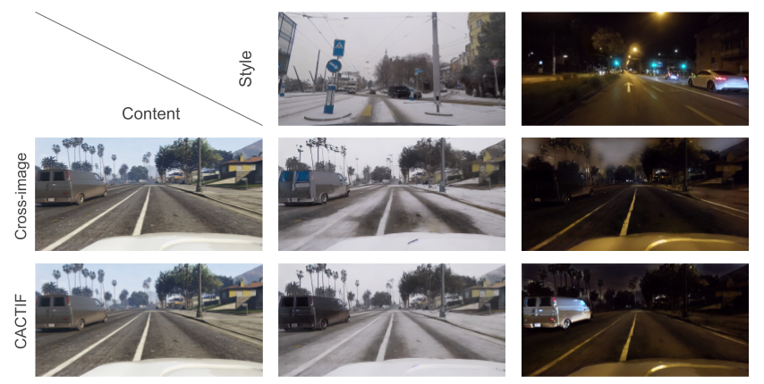

# Style Transfer with Diffusion Models for Synthetic-to-Real Domain Adaptation

> Estelle Chigot, Dennis G. Wilson, Meriem Ghrib, Thomas Oberlin  
> ISAE-SUPAERO, Airbus
>
> Semantic segmentation models trained on synthetic data often perform poorly on real-world images due to domain gaps, particularly in adverse conditions where labeled data is scarce.
Yet, recent foundation models enable to generate realistic images without any training. This paper proposes to leverage such diffusion models to improve the performance of vision models when learned on synthetic data.
We introduce two novel techniques for semantically consistent style transfer using diffusion models: **C**lass-wise **A**daptive Instance Normalization and **C**ross-atten**TI**on (CACTI) and its extension with selective attention **F**iltering (CACTIF).
CACTI applies statistical normalization selectively based on semantic classes, while CACTIF further filters cross-attention maps based on feature similarity, preventing artifacts in regions with weak cross-attention correspondences.
Our methods transfer style characteristics while preserving semantic boundaries and structural coherence, unlike approaches that apply global transformations or generate content without constraints.
Experiments using GTA5 as source and Cityscapes/ACDC as target domains show that our approach produces higher quality images with lower FID scores and better content preservation.
Our work demonstrates that class-aware diffusion-based style transfer effectively bridges the synthetic-to-real domain gap even with minimal target domain data, advancing robust perception systems for challenging real-world applications.

<a href="https://arxiv.org/abs/2505.16360"></a>



## Description  
Official implementation of Style Transfer with Diffusion Models for Synthetic-to-Real Domain Adaptation (CACTIF).


## Environment
Our code builds on the requirement of the `diffusers` library. We use `python 3.8.5`. To set up the CACTIF environment, please run:
```
conda env create -f environment/environment.yaml
conda activate cactif
```

Please download the [GTA5 dataset](https://download.visinf.tu-darmstadt.de/data/from_games/), and link it to the `data` folder of the repository:
```
ln -s /path/to/gta5/ /path/to/CACTIF/data/gta
```

In `data/style` you should put any style image in Cityscapes or ACDC naming convention and their corresponding label. We put a few examples in this repository.

In the end you data folder should look like this:
```
DAFormer
├── ...
├── data
│   ├── gta
│   │   ├── images
│   │   ├── labels
│   ├── style
│   │   ├── images
│   │   ├── labels
├── ...

```

To use the Rare Class Sampling (RCS) strategy during dataset generation, you can follow the [DAFormer data preprocessing](https://github.com/lhoyer/DAFormer) steps.


## Usage  

To generate an image, you can simply run the `run.py` script. For example,
```
# Run CACTIF
python run.py
# Run CACTI
python run.py --name CACTI --filtering False
```
Notes:
- You can specify a name with `--name your_name`.
- You can switch off the filtering operation with `--filtering false`, and the class AdaIN module with `--adain_class false`.
- You can specify the number of images to generate for each style image with `--nb_img_per_style n`.
- You can set `--load_latents` to `True` to load the latents from a file instead of inverting the input images every time. 
  - This is useful if you want to generate multiple images with the same structure but different appearances.


## Acknowledgements 
This code uses a lot of resources from the [Cross-image attention](https://github.com/garibida/cross-image-attention) repository. We sincerely thank the authors for sharing their work.


## Citation
If you use this code for your research, please cite the following work: 
```
@misc{chigot2025cactif,
      title={Style Transfer with Diffusion Models for Synthetic-to-Real Domain Adaptation}, 
      author={Estelle Chigot and Dennis G. Wilson and Meriem Ghrib and Thomas Oberlin},
      year={2025},
      eprint={2505.16360},
      archivePrefix={arXiv},
      primaryClass={cs.CV} 
}
```
